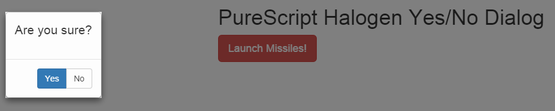
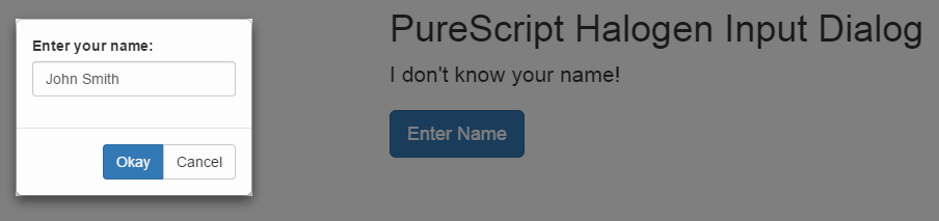

# purescript-halogen-dialog

[PureScript/Halogen](https://github.com/slamdata/purescript-halogen) support for modal dialogs.

[Module Documentation](docs/)

The idea of this library is to make it easy to create reusable modal dialogs in [slamdata](https://github.com/slamdata)'s
[PureScript/Halogen](https://github.com/slamdata/purescript-halogen) framework.

Apart from the general framework, two simple, reusable dialogs are provided:

- a yes/no dialog (see [example](examples/yesno/))
- a text input dialog (see [example](examples/input/))

